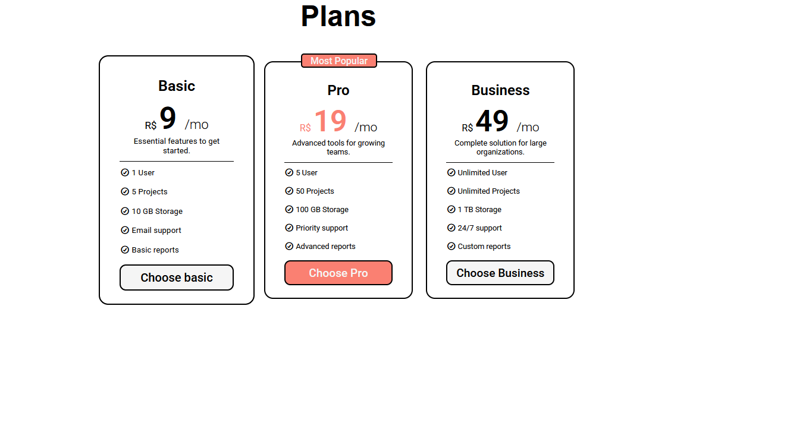

# 💳 Pricing Cards Component

Uma seção moderna e responsiva de cartões de preços desenvolvida com **HTML5** e **CSS3 puro**, baseada no desafio do [roadmap.sh](https://roadmap.sh).



🔗 **[Acesse o projeto online aqui](https://paaulo-13.github.io/Pricing-Cards/)**

---

## 📌 Sobre o Projeto

O objetivo deste projeto foi construir um componente reutilizável de planos de preços (típico de SaaS e páginas de marketing), focando em estruturação semântica, alinhamento flexível e hierarquia visual.

### ✨ Funcionalidades e Destaques
- **Três opções de planos:** Basic, Pro e Business.
- **Card de Destaque:** O plano "Pro" possui ênfase visual com badge estilizado (*Most Popular*) e cores contrastantes.
- **Interatividade:** Efeitos de hover suaves com transição de escala nos cards e estilização de botões.
- **Ícones Semânticos:** Integração com a biblioteca Font Awesome para a listagem de recursos.

---

## 🛠️ Tecnologias e Conceitos Aplicados

- **HTML5:** Estrutura semântica (`<section>`, `<h1>`, `<h2>`, `<ul>`, `<button>`).
- **CSS3 Moderno:**
  - **Flexbox:** Alinhamento horizontal, espaçamento com `gap` e distribuição dos cards.
  - **CSS Box Model:** Controle preciso de `padding`, `border` e `margin`.
  - **Posicionamento (`position`):** Combinação de `relative` e `absolute` para o badge flutuante.
  - **Transições e Pseudo-classes:** Animações com `transform: scale()` e `:hover`.
- **Font Awesome:** Ícones vetoriais via CDN.
- **Google Fonts:** Tipografia com Roboto e Caacupe One.

---

## 🚀 Como Executar o Projeto Localmente

1. Clone o repositório:
   ```bash
   git clone https://github.com/paaulo-13/Pricing-Cards.git